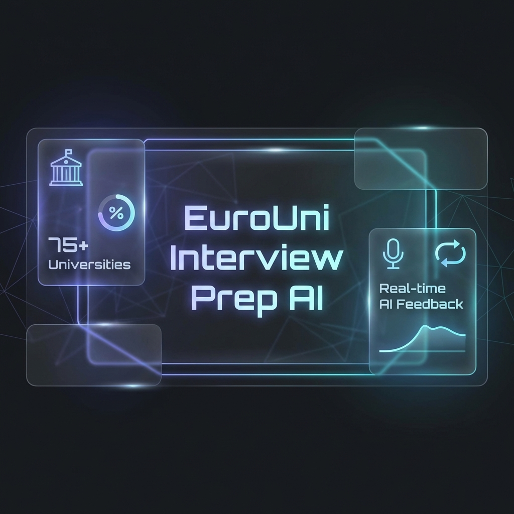

<div align="center">
  

  # 🎓 EuroUni Interview Prep AI
  
  **The ultimate AI-powered preparation platform for European Academic Admissions.**
  
  [](https://doi.org/10.5281/zenodo.18368124)
  [](https://nextjs.org/)
  [](https://www.prisma.io/)
  [](https://www.typescriptlang.org/)

  ---

  *EuroUni simulates real European academic interviews, evaluating candidate readiness based on European academic norms—moving beyond generic corporate prep into high-fidelity research and fit simulations.*

</div>

---

## 🚀 Key Innovation Pillars

### 🎨 Elite Visual Overhaul
- **Dark Glassmorphism UI**: A premium, high-contrast interface designed for focus and aesthetic excellence.
- **Dynamic Hero Section**: Real-time program indexing stats (**75+ Universities**, **50+ Programs**) with interactive search.
- **Responsive Dashboard**: Unified view for program details, interview simulation, and institutional context.

### 🧠 Faculty Persona Simulator
- **Research-Aligned AI Professors**: Interactive chat with personas that probe technical depth and program fit.
- **Live Voice Mode**: Integrated speech-to-text for hands-free interview practice.
- **European Tone Evaluation**: Feedback on academic sobriety and evidence-based argumentation.

### 📄 SOP ↔ Interview Consistency Checker
- **SOP Analyzer**: High-fidelity analysis of Statement of Purpose for European academic norms.
- **Claim Verification**: Predicts faculty follow-up questions based on SOP content.
- **Risk Mitigation**: Flags weakly supported claims or over-commercialized language.

### 📊 Progressive Performance Analytics
- **Historical Tracking**: Monitor score trends over multiple simulations.
- **Prisma & SQLite Backend**: Robust persistence for candidate evaluations and preparation history.

---

## 🏛️ Integrated Institutions (Phase 1)
Direct integration of English-taught programs from Europe's top institutions across **20+ countries**:

| Region | Featured Institutions |
| :--- | :--- |
| **France** | PSL University, École Polytechnique, Sorbonne, Paris-Saclay |
| **Germany** | TUM, LMU Munich, Heidelberg, University of Bonn |
| **United Kingdom** | Oxford, Cambridge, Imperial College London, UCL |
| **Switzerland** | ETH Zurich, University of Zurich, EPFL |
| **Netherlands** | Delft, Amsterdam (UvA), Utrecht, Leiden |
| **Nordics** | KTH Royal Institute, Lund, Aalto, University of Helsinki |
| **Belgium** | Vrije Universiteit Brussel (VUB) |

---

## 🧩 Tech Architecture
Built with modern, high-performance web technologies:
- **Framework**: Next.js 15 (App Router, Turbopack)
- **Database**: SQLite (via Better-SQLite3)
- **ORM**: Prisma (with dedicated driver adapters for high-fidelity edge performance)
- **Styling**: Modular CSS with advanced Glassmorphism design tokens
- **Intelligence**: Structured LLM evaluation via JSON schema matching

---

## 📖 Citation & Research
If you use this software in academic work, please cite it as:

```bibtex
@software{daakshayani2026eurouni,
  author  = {Daakshayani, N. S.},
  title   = {EuroUni Interview Prep AI: AI-Based Interview Readiness and Evaluation System for European University Admissions},
  year    = {2026},
  version = {1.0.0},
  doi     = {10.5281/zenodo.18368124},
  url     = {https://github.com/Daaksh05/euro-uni-interview-prep-}
}
```

> [!NOTE]
> This project is published as a citable research software artifact with a Zenodo DOI. It reflects European academic norms in admissions evaluation, research alignment, and communication practices.

---

<div align="center">
  Developed by <b>Daakshayani N S</b>
</div>
